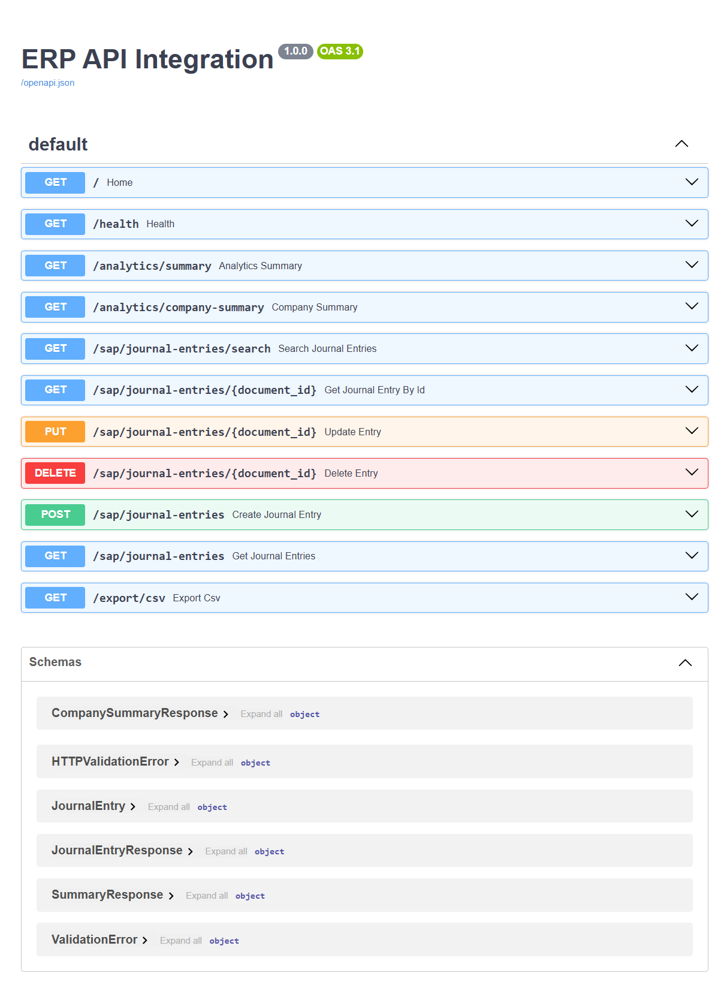
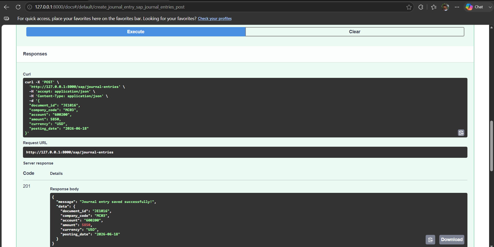
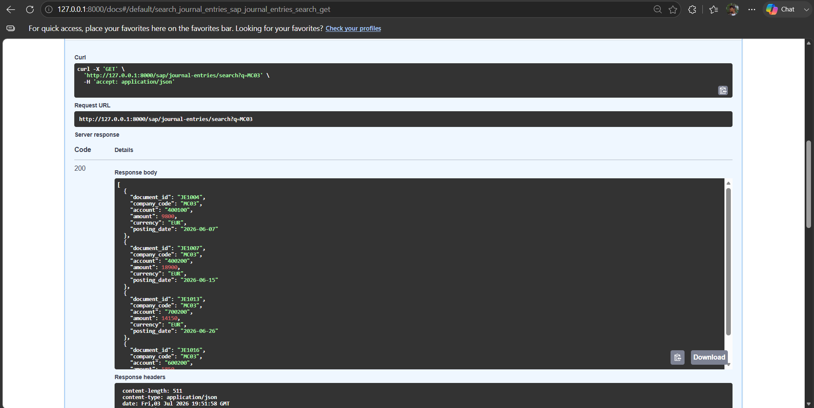
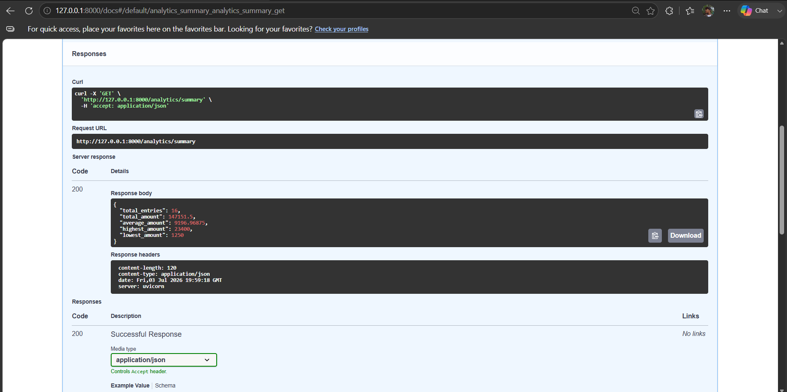
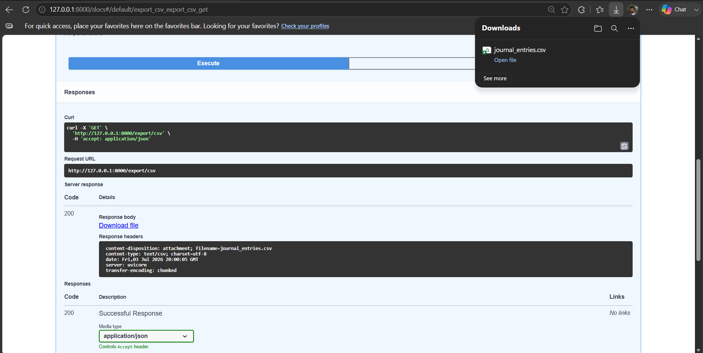
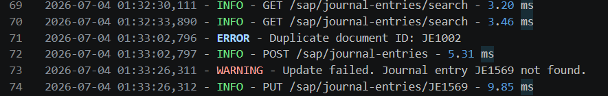

# ERP API Integration

**Version:** 1.0.0

## Overview

ERP API Integration is a RESTful backend application built using **FastAPI** and **SQLite**. It simulates the integration of SAP journal entries by providing CRUD operations, advanced filtering, search, analytics, CSV export, logging, and automatic API documentation through Swagger UI.

---

## Features

- Create, Read, Update and Delete Journal Entries
- Search Journal Entries
- Filter by Company Code
- Filter by Currency
- Filter by Account
- Filter by Date Range
- Sorting
- Pagination
- Journal Entry Analytics
- Company-wise Analytics
- CSV Export
- Request Logging
- Request Performance Monitoring
- Health Check Endpoint
- Swagger/OpenAPI Documentation
- SQLite Database

---

## Tech Stack

- Python 3
- FastAPI
- SQLite
- Pydantic
- Uvicorn

---

## Project Structure

```text
ERP_API_Integration/
│
├── app/
│   ├── database.py
│   ├── logger.py
│   ├── main.py
│   ├── models.py
│
├── erp.db
├── erp.log
├── requirements.txt
└── README.md
```

---

## Installation

### Clone the repository

```bash
git clone <repository-url>
```

### Navigate to the project

```bash
cd ERP_API_Integration
```

### Create a virtual environment

```bash
python -m venv venv
```

### Activate the virtual environment (Windows)

```bash
venv\Scripts\activate
```

### Install dependencies

```bash
pip install -r requirements.txt
```

### Run the application

```bash
uvicorn app.main:app --reload
```

---

## API Documentation

After starting the server:

### Swagger UI

```text
http://127.0.0.1:8000/docs
```

### ReDoc

```text
http://127.0.0.1:8000/redoc
```

---

## API Endpoints

| Method | Endpoint | Description |
|---------|----------|-------------|
| GET | `/` | Home |
| GET | `/health` | Health Check |
| POST | `/sap/journal-entries` | Create Journal Entry |
| GET | `/sap/journal-entries` | Get All Journal Entries |
| GET | `/sap/journal-entries/{document_id}` | Get Journal Entry by ID |
| PUT | `/sap/journal-entries/{document_id}` | Update Journal Entry |
| DELETE | `/sap/journal-entries/{document_id}` | Delete Journal Entry |
| GET | `/sap/journal-entries/search` | Search Journal Entries |
| GET | `/analytics/summary` | Overall Analytics |
| GET | `/analytics/company-summary` | Company-wise Analytics |
| GET | `/export/csv` | Export Journal Entries as CSV |

---

## Sample Request

```json
{
  "document_id": "SQL001",
  "company_code": "MC01",
  "account": "400100",
  "amount": 1000,
  "currency": "INR",
  "posting_date": "2026-06-27"
}
```

---

## Sample Response

```json
{
  "message": "Journal entry saved successfully!",
  "data": {
    "document_id": "SQL001",
    "company_code": "MC01",
    "account": "400100",
    "amount": 1000,
    "currency": "INR",
    "posting_date": "2026-06-27"
  }
}
```

---

## Logging

The application records the following events:

- Journal Entry Creation
- Journal Entry Update
- Journal Entry Deletion
- Duplicate Entry Errors
- Failed Update/Delete Operations
- Request Processing Time

Logs are stored in:

```text
erp.log
```

---

## CSV Export

The application allows exporting all journal entries as a CSV file.

Endpoint:

```text
GET /export/csv
```

The downloaded file contains:

- Document ID
- Company Code
- Account
- Amount
- Currency
- Posting Date

---

## Health Check

The application provides a health check endpoint to verify API and database availability.

Endpoint:

```text
GET /health
```


## Screenshots

### Swagger UI



### Create Journal Entry



### Get All Entries



### Analytics



### CSV Export



### Logs



---

## Future Improvements

- PostgreSQL Integration
- SQLAlchemy ORM
- JWT Authentication
- Docker Support
- Automated Testing (Pytest)
- SAP RFC Integration
- Message Queue Support (Kafka/RabbitMQ)
- Cloud Deployment
- Role-Based Access Control (RBAC)

---

## License

This project was developed as part of an ERP API Integration internship assignment.

---

## Author

**Shahid Patel**